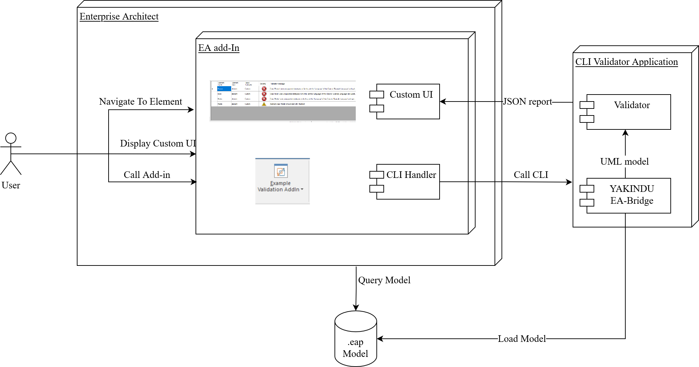

# Enterprise Architect - YAKINDU EA-Bridge Integration Example

The example contained in this repository demonstrate the integration of the Enterprise Architect (EA) modeling tool with a command-line Java application for **model validation**. A simple EA Add-in calls the Java application which loads the `.eap/.eapx` file, performs validations on that model and returns the result. Then the EA Add-in loads and displays the validation issues in a custom UI view including the possibility to navigate to the corresponding elements in the EA project browser or in existing diagrams. 
The following diagram illustrates how this example works:

This example may also serve as a template for further use cases such as custom model validation, code generation, or reporting.

**Advantages** of this approach are:

* **Performance**: the Java application loads and processes large EA models *much faster* (up to 50x) than using EA's API.
* **Standard compliance**: the model is loaded as a *standard UML model* and can be processed with *powerful languages* such as Java or Xtend.
* **Seamless integration**: the EA Add-in *integrates* powerful model processing into the UI of Enterprise Architect.

*This example is tested with Enterprise Architect 15.*

## How to run this example 

This repository consists of two codebases:
    
* The command-line interface (CLI) is a headless Java application containing the [YAKINDU EA-Bridge](https://www.itemis.com/en/yakindu/ea-bridge/) for loading UML models from eap-files; it further performs UML syntax validation and runs an exemplary custom validation rule. The result of this validation is stored in a json-file for further use with other tools such as the EA Add-in below.

* The EA Add-in allows the user to validate the model using a UI integrated in Enterprise Architect; it further lists the validation results in a custom view inside EA without the need to use the command line. A *double click* on a validation result in EA selects the corresponding element in the Project Browser and opens the diagram containing that element (if such a diagram exists).

Please follow these steps to try out the pre-built example on your local machine:
1. Download the [zip-package]() and extract it to some location on your hard-drive.
2. Download the [Add-in installer]() and install it (EA must not be running).
3. Start EA, go to *Specialize* &rarr; *YAKINDU EA-Bridge Integration* &rarr; *Configure CLI Path* &rarr; and set the path to the folder into which you extracted the zip-package.
4. Validate your model via the context-menu on a package in the Project Browser and select *Specialize* %rarr; *YAKINDU EA-Bridge Integration* &rarr; *Example Model Validation* &rarr; it will take a few seconds, then check the Add-in window for the result.

## How to build this example

* Validation CLI: 

    The validation CLI is an OSGi application written in Java. Simply run the following maven command to build it.  

    `cd CLI`

    `mvn clean package`

* EA Add-in:
    The Add-in is written in C# and uses the [automation API provided by Enterprise Architect](https://sparxsystems.com/enterprise_architect_user_guide/15.0/add-ins___scripting/addins_2.html) to access the model and add custom views to the UI. The UI extensions are simple Windows controls and forms. The entire Add-in is a .NET-based COM application. 
    To build the Add-in you need the following tools:
    * Visual Studio 2022. In the IDE, the following extensions are required:
        * NUnit 3 Test Adapter: required to build and run tests. It can be installed using the extension manager in Visual Studio.
        * Wix Toolkit Visual Studio 2022 extensions: The Wix toolset is required to build the Add-in installer package. It can be installed using the extension manager in Visual Studio. However, it must be accompanied by the installation of the Wix tool which can be downloaded [here](https://wixtoolset.org/releases/).
    * [Enterprise Architect version 15.2](https://sparxsystems.com/products/ea/downloads.html)

    After installing these tools, open the solution [`AddIn\EABridge_Example_AddIn.sln`](./AddIn/EABridge_Example_AddIn.sln) and build all projects contained in it. To register the built Add-in `DLL` with Enterprise Architect, run the script [`AddIn\EABridge_Example_AddIn\Install.bat`](./AddIn/EABridge_Example_AddIn/Install.bat). This script registers the DLL built by the IDE with Enterprise Architect as the Add-in. It needs to be run only once. When the Add-in installer is used, the DLL in the specified installation location will be used instead.   

# Contribute

We are always happy to see suggestions, bug reports, feature requests as well as pull requests. Please feel free to raise an issue or contribute with a pull request. 

# Further information

The [YAKINDU EA-Bridge|https://www.itemis.com/en/yakindu/ea-bridge/] has a free 30-day trial period which can be used with models containing up to 1000 elements. 
For a (free) unlimited evaluation license, please contact us via the website or e-mail: bridges @ yakindu.com
